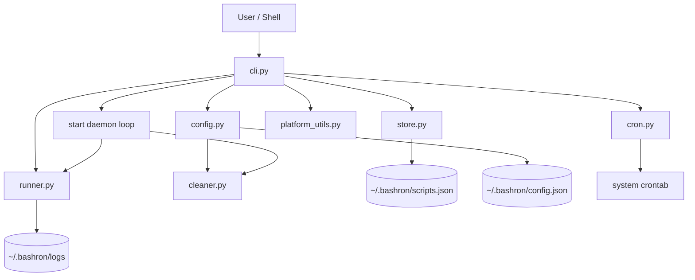

# Architecture

This diagram is the fastest way for a new contributor to understand how `bashron` is wired.

## Reading Order

1. `src/bashron/cli.py`
2. `src/bashron/store.py`
3. `src/bashron/runner.py`
4. `src/bashron/config.py`
5. `src/bashron/cleaner.py`
6. `src/bashron/cron.py`
7. `src/bashron/platform_utils.py`
8. `src/bashron/service.py`
